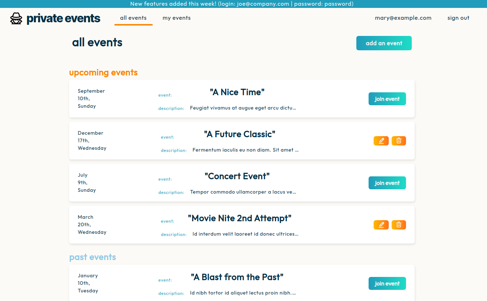
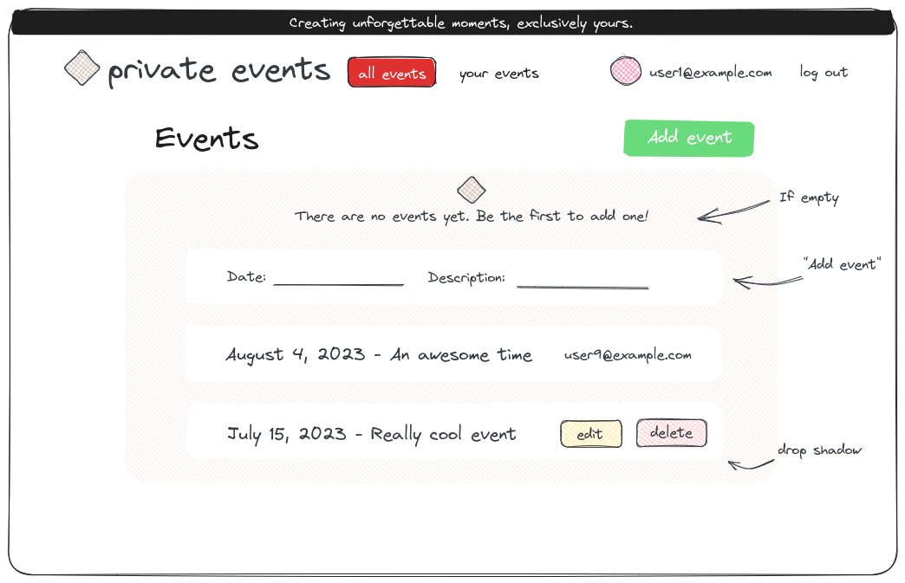

Odin Rails Project: Private-Events
==================================

This is a project assignment from The Odin Project. --Finish README--

[ __[ LINK TO PROJECT SPECS PAGE ]__ ](https://www.theodinproject.com/lessons/ruby-on-rails-private-events)

[ __[ LINK TO DEPLOYED APP ]__ ](https://private-events-app.fly.dev/)--app may be offline--

Screenshots
-----------

 

(Design Sketch)

How it's made:
--------------

Tech used: HTML, CSS, Ruby on Rails, RSpec

My Goals
--------

We've been reading a ton about associations in Rails and I want to apply that knowledge. I hope to gain an understanding of many-to-many relationships along with all of the methods Rails provides for free.

Redoing part of this project now using BEM and SCSS for better organization of CSS.

## Thoughts After

* Following BEM (as best as I could) felt like a big step in the right direction for managing CSS.

* Nesting routes is tricky business and I need to do it several more times to get a feel for it.

* Creating partials helps organization but extracting out too many seems to be a hindrance. Need to find a balance.

* RESTful design requires a shift in thinking about how methods are implemented. Adding methods arbitrarily to a controller or app/helpers feels wrong.
