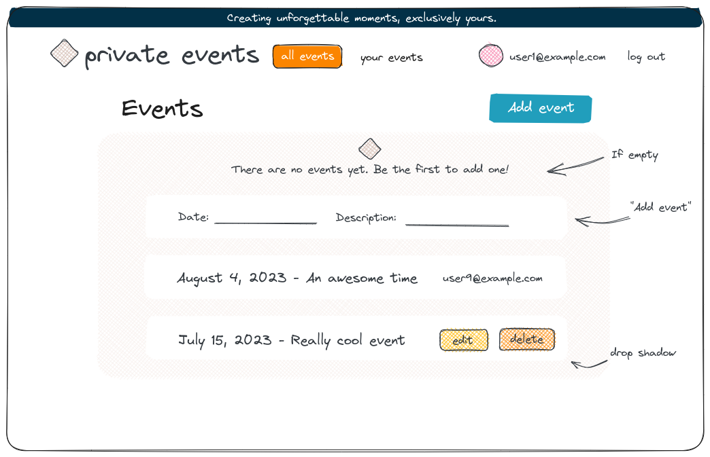

# Rails Project: Private Events

> Link to project specs can be found here:  
> https://www.theodinproject.com/lessons/ruby-on-rails-private-events

## Screenshots

## Description

We want to build a site similar to a private Eventbrite, which allows users to create events and then manage user signups.

* A user can create events.
* A user can attend many events.
* Events take place at a specific date and a specific location

## My Goals

We've been reading a ton about associations in Rails and I want to apply that knowledge. I hope to gain an understanding of many-to-many relationships along with all of the methods Rails provides for free.

Redoing part of this project now using BEM and SCSS for better organization of CSS.
